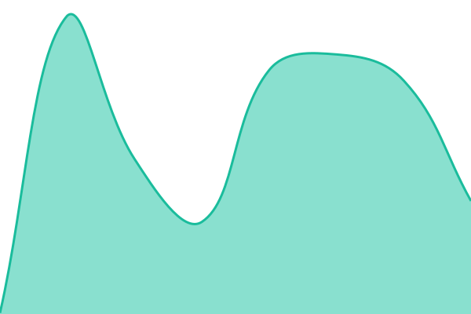

# [📈 Live Status](https://status.fyralabs.com): <!--live status--> **🟩 All systems operational**

This repository contains the open-source uptime monitor and status page for [Fyra Labs](https://fyralabs.com), powered by [Upptime](https://github.com/upptime/upptime).

With [Upptime](https://upptime.js.org), you can get your own unlimited and free uptime monitor and status page, powered entirely by a GitHub repository. We use [Issues](https://github.com/FyraLabs/status/issues) as incident reports, [Actions](https://github.com/FyraLabs/status/actions) as uptime monitors, and [Pages](https://status.fyralabs.com) for the status page.

<!--start: status pages-->
<!-- This summary is generated by Upptime (https://github.com/upptime/upptime) -->
<!-- Do not edit this manually, your changes will be overwritten -->
<!-- prettier-ignore -->
| URL | Status | History | Response Time | Uptime |
| --- | ------ | ------- | ------------- | ------ |
|  [Homepage](https://fyralabs.com) | 🟩 Up | [homepage.yml](https://github.com/FyraLabs/status/commits/HEAD/history/homepage.yml) | 

 116ms
     
 | 

<a href="https://status.fyralabs.com/history/homepage">100.00%</a>
    

|  [Blog](https://blog.fyralabs.com) | 🟩 Up | [blog.yml](https://github.com/FyraLabs/status/commits/HEAD/history/blog.yml) | 

 823ms
     
 | 

<a href="https://status.fyralabs.com/history/blog">99.61%</a>
    

|  [Devdocs](https://developer.fyralabs.com) | 🟩 Up | [devdocs.yml](https://github.com/FyraLabs/status/commits/HEAD/history/devdocs.yml) | 

 120ms
     
 | 

<a href="https://status.fyralabs.com/history/devdocs">100.00%</a>
    

|  [Wiki](https://wiki.fyralabs.com) | 🟩 Up | [wiki.yml](https://github.com/FyraLabs/status/commits/HEAD/history/wiki.yml) | 

 891ms
     
 | 

<a href="https://status.fyralabs.com/history/wiki">100.00%</a>
    

|  [Weblate](https://weblate.fyralabs.com) | 🟩 Up | [weblate.yml](https://github.com/FyraLabs/status/commits/HEAD/history/weblate.yml) | 

 818ms
     
 | 

<a href="https://status.fyralabs.com/history/weblate">99.62%</a>
    

|  [Terra Homepage](https://terrapkg.com) | 🟩 Up | [terra-homepage.yml](https://github.com/FyraLabs/status/commits/HEAD/history/terra-homepage.yml) | 

 152ms
     
 | 

<a href="https://status.fyralabs.com/history/terra-homepage">100.00%</a>
    

|  [Terra Docs](https://docs.terrapkg.com) | 🟩 Up | [terra-docs.yml](https://github.com/FyraLabs/status/commits/HEAD/history/terra-docs.yml) | 

 112ms
     
 | 

<a href="https://status.fyralabs.com/history/terra-docs">100.00%</a>
    

|  [Package Repositories](https://repos.fyralabs.com) | 🟩 Up | [package-repositories.yml](https://github.com/FyraLabs/status/commits/HEAD/history/package-repositories.yml) | 

 464ms
     
 | 

<a href="https://status.fyralabs.com/history/package-repositories">100.00%</a>
    

|  [Subatomic](https://subatomic.fyralabs.com/heartbeat) | 🟩 Up | [subatomic.yml](https://github.com/FyraLabs/status/commits/HEAD/history/subatomic.yml) | 

 360ms
     
 | 

<a href="https://status.fyralabs.com/history/subatomic">100.00%</a>
    

|  [Madoguchi](https://madoguchi.fyralabs.com/health) | 🟩 Up | [madoguchi.yml](https://github.com/FyraLabs/status/commits/HEAD/history/madoguchi.yml) | 

 368ms
     
 | 

<a href="https://status.fyralabs.com/history/madoguchi">100.00%</a>
    

|  [Tetsudou](https://tetsudou.fyralabs.com/metalink?repo=terrarawhide) | 🟩 Up | [tetsudou.yml](https://github.com/FyraLabs/status/commits/HEAD/history/tetsudou.yml) | 

 247ms
     
 | 

<a href="https://status.fyralabs.com/history/tetsudou">100.00%</a>
    

<!--end: status pages-->

[**Visit our status website →**](https://status.fyralabs.com)

## 📄 License

- Powered by: [Upptime](https://github.com/upptime/upptime)
- Code: [MIT](./LICENSE) © [Fyra Labs](https://fyralabs.com)
- Data in the `./history` directory: [Open Database License](https://opendatacommons.org/licenses/odbl/1-0/)
